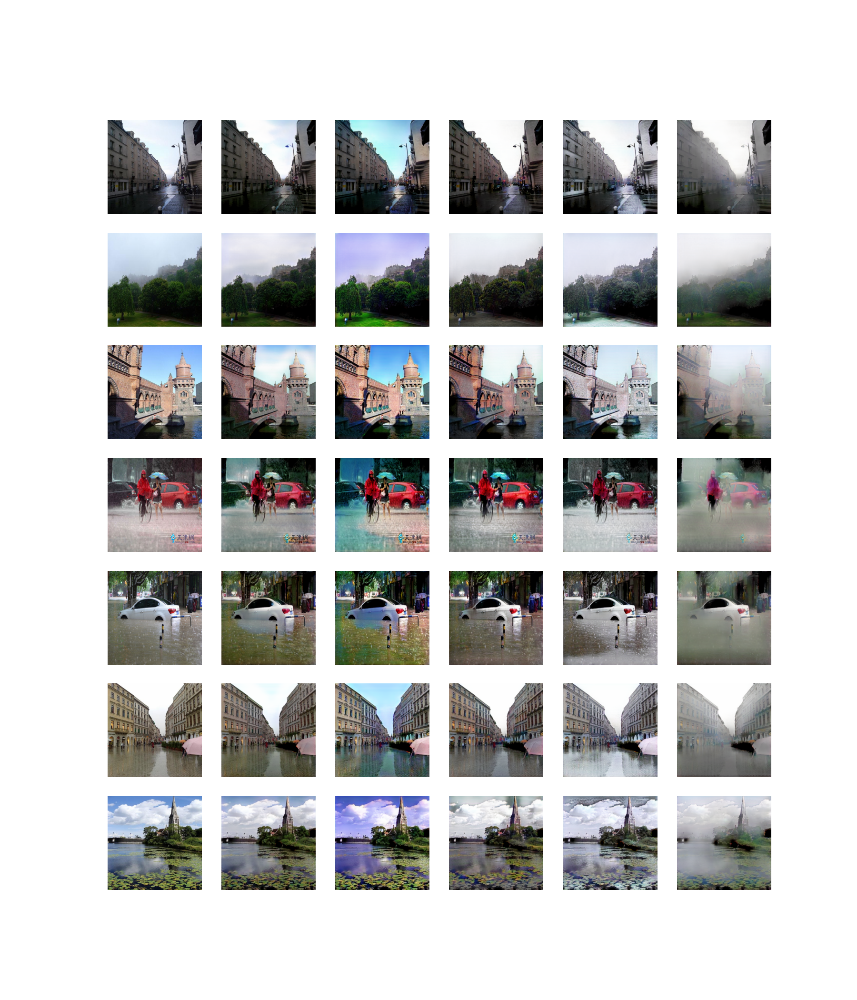

# Weather Style Translation with StarGAN

This project presents a Weather Style Translation model built upon the StarGAN architecture, enabling the transformation of weather conditions in images from one category to another. The primary goal is to facilitate image-to-image translation across multiple weather domains using a single unified model.

## Model Overview
StarGAN is a generative adversarial network (GAN) framework that allows for multi-domain image-to-image translation. In this project, we adapt StarGAN to handle weather style transfer, training it to convert images between the following weather categories:

- Sunny
- Cloudy
- Rainy
- Snowy
- Foggy

The model is trained on a custom dataset containing approximately 2,000 images per class, ensuring diverse and representative samples for each weather condition. By leveraging the StarGAN approach, the model learns to translate an input image from its original weather domain to any of the target domains, while preserving the underlying content and structure of the image.

## Applications
This weather translation model can be used for:
- Data augmentation for weather-robust computer vision systems
- Visual effects and creative editing
- Simulation and training for autonomous vehicles
- Research in domain adaptation and style transfer

## Example
The image below demonstrates the effect of the model, showing the same input image translated into different weather categories:

